W
=

W is a simple X (formerly Twitter) clone using Spring Boot, Thymeleaf, Tailwindcss, and SQL Server.

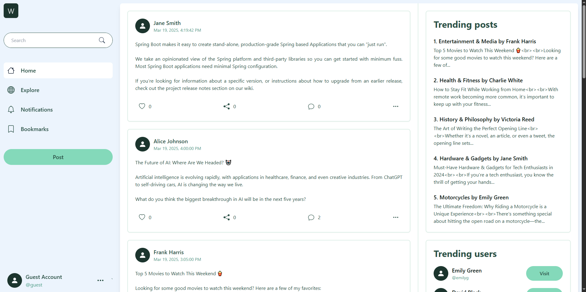

# Table of Contents
1. [Features](#features)
2. [Usage](#usage)
3. [Running Locally](#running-locally)

# Features
* Create posts and share them with other W users
* Follow other users and view a personalized feed of their posts
* Interact with other users by liking, commenting, or sharing their posts
* Bookmark favorite posts and comments to view at a later date
* Customize personal profile with custom avatar or banner image
* Keep up with the latest topics with trending posts and users
* And many more (probably :vv)

# Usage
To access W features, you need to have a W account. You can register a new W account by providing your email and password.

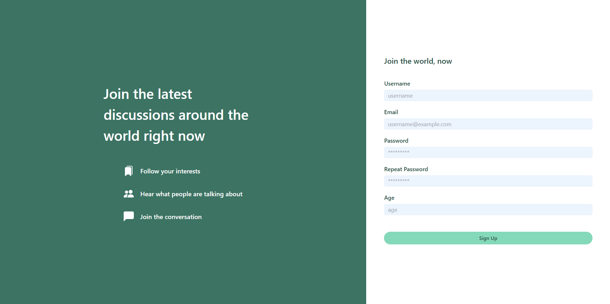

If you already have an account but forgot the password, you can send a password reset request to the W system. The system will then send an email containing a password reset link to your associated email address.

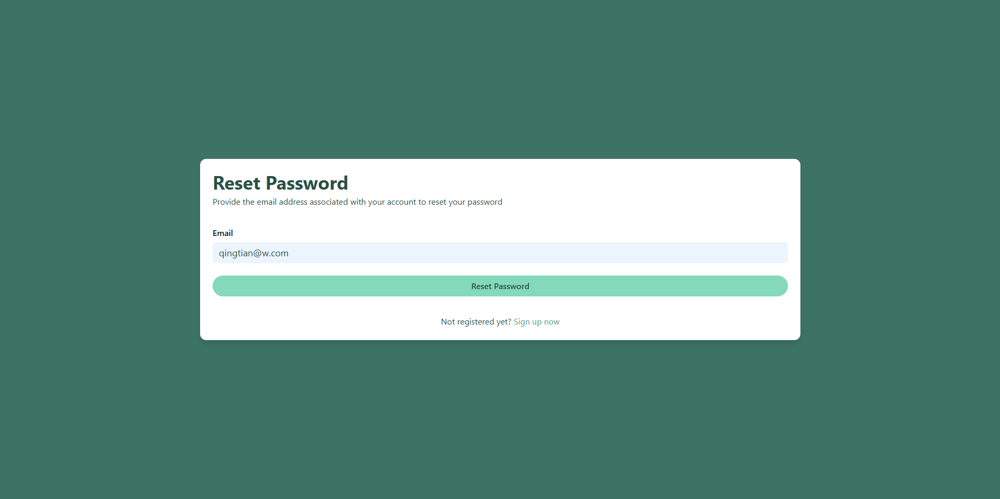

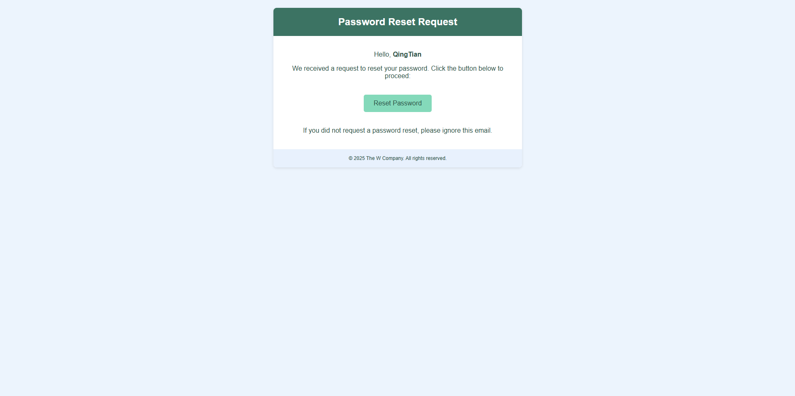

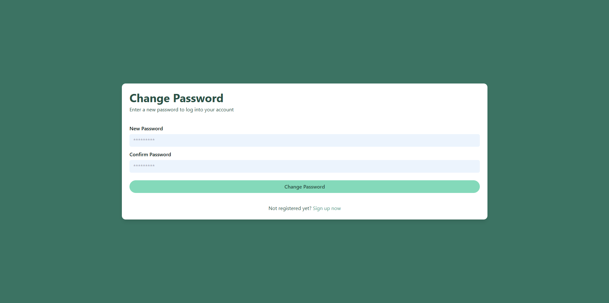

## User Interactions
Once you have created an account, you can start posting immediately. Alternatively, you can also search for some users to follow in the global feed. **Please note that all posts will appear on the global feed regardless of posters.**

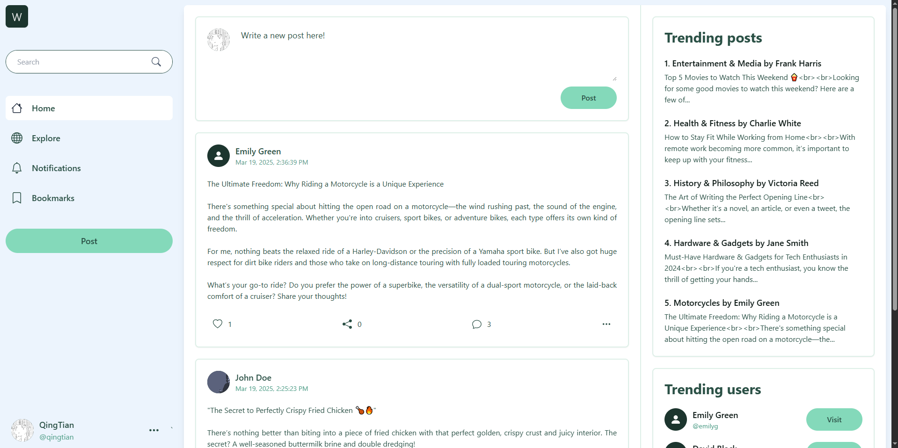

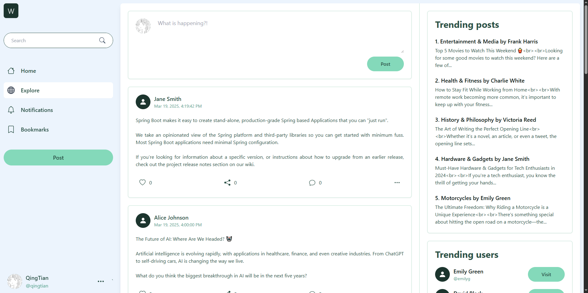

Whenever users like, share, or comment on your posts, you will receive a notification for each interaction. Additionally, you may also be notified of system updates or admin messages.

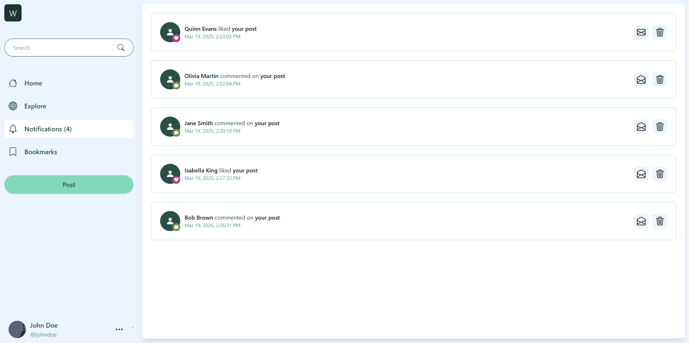

## Updating Personal Profile
To update your W profile, simply access your profile page and click on the "Edit Profile" button. To update your avatar or banner image, click on the avatar or the banner frame and click on the upload button.

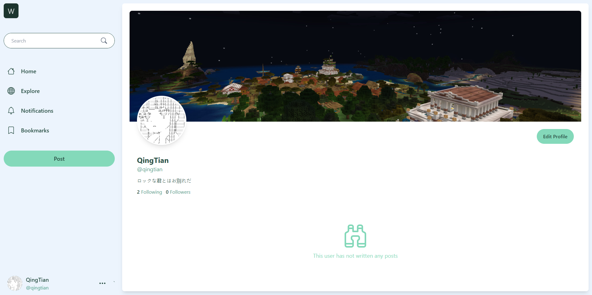

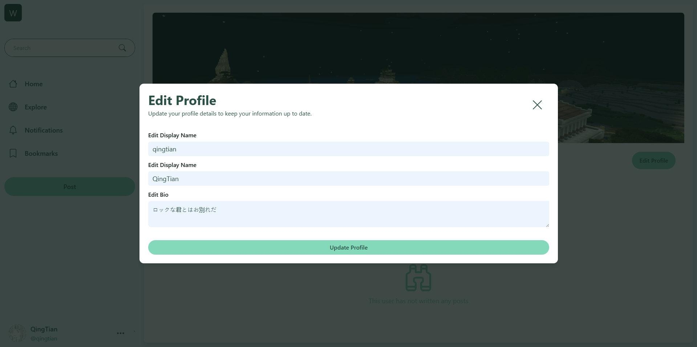

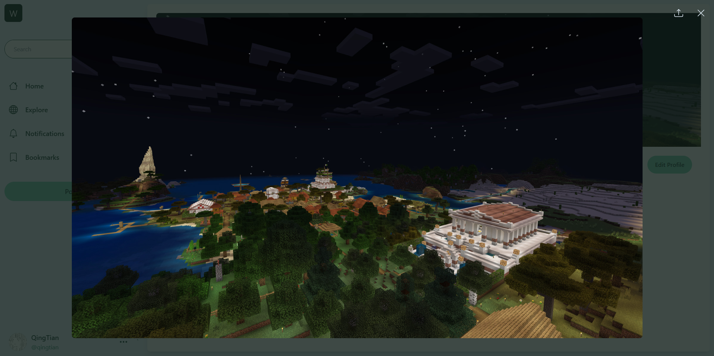